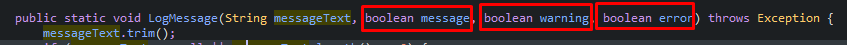
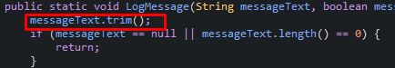
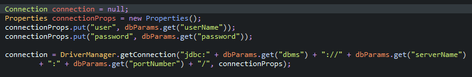
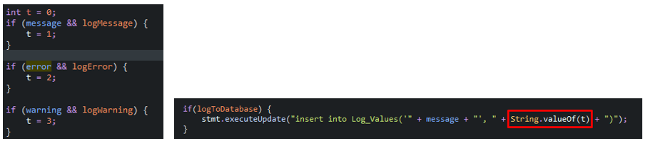
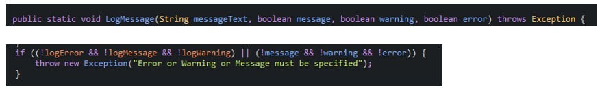
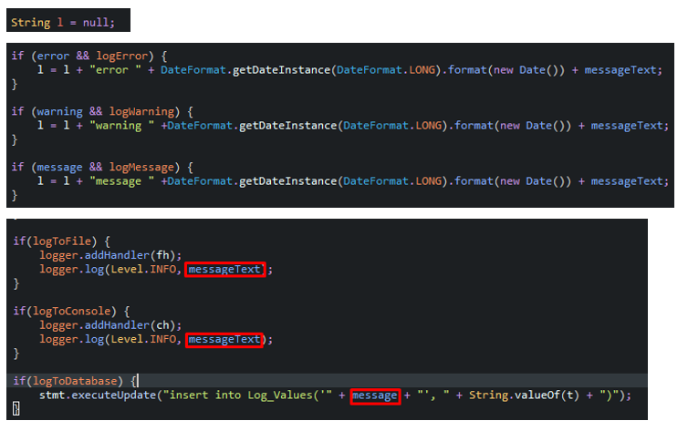
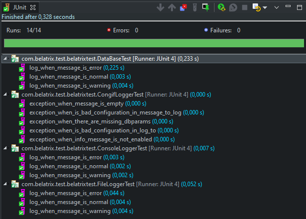

# BELATRIX TEST

## CODE REVIEW / REFACTORING EXERCISE

Please review the following code snippet. Assume that all referenced assemblies have been properly included.

The code is used to log different messages throughout an application. We want the ability to be able to log to a text file, the console and/or the database. Messages can be marked as message, warning or error. We also want the ability to selectively be able to choose what gets logged, such as to be able to log only errors or only errors and warnings.

1. If you were to review the following code, what feedback would you give? Please be specific and indicate any errors that would occur as well as other best practices and code refactoring that should be done.

2. Rewrite the code based on the feedback you provided in question 1. Please include unit tests on your code.

```java
import java.io.File;
import java.sql.Connection;
import java.sql.DriverManager;
import java.sql.Statement;
import java.text.DateFormat;
import java.util.Date;
import java.util.Map;
import java.util.Properties;
import java.util.logging.ConsoleHandler;
import java.util.logging.FileHandler;
import java.util.logging.Level;
import java.util.logging.Logger;

public class JobLogger {
  private static boolean logToFile;
  private static boolean logToConsole;
  private static boolean logMessage;
  private static boolean logWarning;
  private static boolean logError;
  private static boolean logToDatabase;
  private boolean initialized;
  private static Map dbParams;
  private static Logger logger;

  public JobLogger(boolean logToFileParam, boolean logToConsoleParam, boolean logToDatabaseParam,
      boolean logMessageParam, boolean logWarningParam, boolean logErrorParam, Map dbParamsMap) {
    logger = Logger.getLogger("MyLog");
    logError = logErrorParam;
    logMessage = logMessageParam;
    logWarning = logWarningParam;
    logToDatabase = logToDatabaseParam;
    logToFile = logToFileParam;
    logToConsole = logToConsoleParam;
    dbParams = dbParamsMap;
  }

  public static void LogMessage(String messageText, boolean message, boolean warning, boolean error) throws Exception {
    messageText.trim();
    if (messageText == null || messageText.length() == 0) {
      return;
    }
    if (!logToConsole && !logToFile && !logToDatabase) {
      throw new Exception("Invalid configuration");
    }
    if ((!logError && !logMessage && !logWarning) || (!message && !warning && !error)) {
      throw new Exception("Error or Warning or Message must be specified");
    }

    Connection connection = null;
    Properties connectionProps = new Properties();
    connectionProps.put("user", dbParams.get("userName"));
    connectionProps.put("password", dbParams.get("password"));

    connection = DriverManager.getConnection("jdbc:" + dbParams.get("dbms") + "://" + dbParams.get("serverName")
        + ":" + dbParams.get("portNumber") + "/", connectionProps);

    int t = 0;
    if (message && logMessage) {
      t = 1;
    }

    if (error && logError) {
      t = 2;
    }

    if (warning && logWarning) {
      t = 3;
    }

    Statement stmt = connection.createStatement();

    String l = null;
    File logFile = new File(dbParams.get("logFileFolder") + "/logFile.txt");
    if (!logFile.exists()) {
      logFile.createNewFile();
    }

    FileHandler fh = new FileHandler(dbParams.get("logFileFolder") + "/logFile.txt");
    ConsoleHandler ch = new ConsoleHandler();

    if (error && logError) {
      l = l + "error " + DateFormat.getDateInstance(DateFormat.LONG).format(new Date()) + messageText;
    }

    if (warning && logWarning) {
      l = l + "warning " +DateFormat.getDateInstance(DateFormat.LONG).format(new Date()) + messageText;
    }

    if (message && logMessage) {
      l = l + "message " +DateFormat.getDateInstance(DateFormat.LONG).format(new Date()) + messageText;
    }

    if(logToFile) {
      logger.addHandler(fh);
      logger.log(Level.INFO, messageText);
    }

    if(logToConsole) {
      logger.addHandler(ch);
      logger.log(Level.INFO, messageText);
    }

    if(logToDatabase) {
      stmt.executeUpdate("insert into Log_Values('" + message + "', " + String.valueOf(t) + ")");
    }
  }
}
```

## REVIEW

1. Method names must not start in uppercase as `LogMessage`.

2. The statement indicates that messages can be marked as type as message, warning or error. Nevertheless, the static LogMessage method allows the message to be marked as more than one type; In this case you should receive only two parameters that are: the message and type of message.


3. When starting the method it was intended to do `messageText.trim()` and then validate if the text is null or has a size of 0; this evidences the following inconveniences:
   - Execute `trim()` fuction before validating if the message is `null` can cause an exception.
   - The result of the `trim()` is not being stored; therefore, if `messageText` is `" "` it can pass the validation.


4. The connection to the database should be made only if the configuration has the option `logToDatabase` enabled.


5. Error code validation is only being used to save in the database the code error, this should also be done only if the configuration has the option `logToDatabase` enabled.
The type of the variable is marked as an `int` and in the only part in which it is being used it is cast to `String`; therefore, It could be defined as `String` from the beginning.


6. As indicated above, the allows a `messagaText` to be marked as a `message, warningn and error` at the same time. The validations in the code allows the execution of the program in cases that not should allow it, for example: there may be cases in which `messageText` is marked as an `error` and the configuration only allows to log messages and warnings.


7. Variable `l` is started as `null`, concatenation operation `l = l + "another text"` is going to generate the result `nullanother text`. In addition, if it is indicated that `messageText` has more than one type the result would be `nullerror...warning...message..."`. It's important to have on mind that the `l` is not being used to send to any log, and in the database `insert` statement it is being send the variable `message` which is a boolean.


8. Configuration variables and `LogMessage` method are declared as a `static`, this implies that those have a class behavior and not an instance behavior; the `static` variables are initialized from the constructor. In case there are several threads of execution or simply with generating a new `JobLogger` instance with a different configuration, the settings are going to will change for all.
Here you can have two scenaries:
   - **configuration will be global for the entire application**: in this case it is convenient that the variables and the method are static. Nevertheless, the configuration should be fixed.
   - **Configuration can be customized in any situation in which you want to use**: in this case, the variables and methods should not be static, thus, when making an instance of the class its behavior is described, and the instance will be used to access to `LogMessage` method.

9. In general, some variables do not describe the information they can store, so the person who must edit the code will take longer to understand; for example: `dbParams` variable should have only database parameters. Nevertheless, it includes the log directory path. Also, it is necessary to fragment the code into specific logic for `log to console`, `log to file`, `log to database`; because the logic is all in the same method and without any order.

## JUNIT TEST

To launch the application's test run:

> mvn clean test

Here the results:


